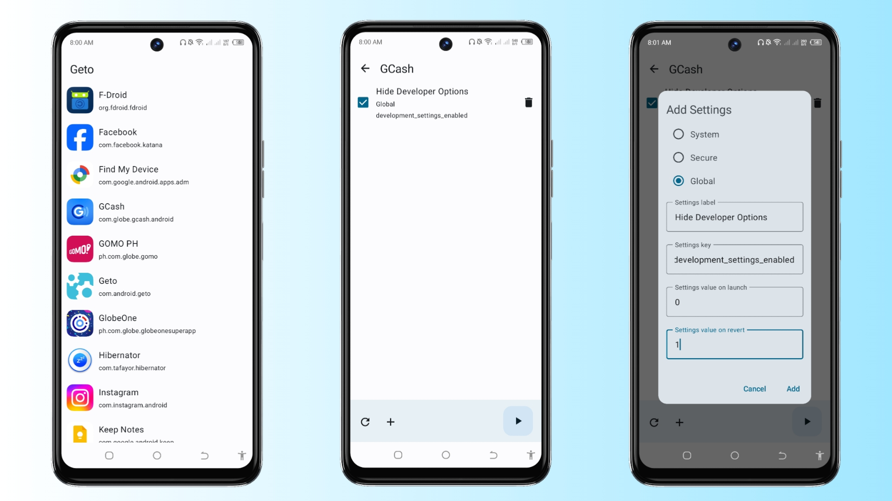

Geto
==================
[](https://f-droid.org/en/packages/com.android.geto/)

An Android app that can modify your device settings and apply them to a specific user app.
App must be granted with **android.permission.WRITE_SECURE_SETTINGS** to make it work properly.

## Screenshots



# Installation

This guide is only for non-pc and Android 11+

1. **Install Shizuku and aShell:**
   - Download and install [Shizuku](https://play.google.com/store/apps/details?id=moe.shizuku.privileged.api&hl=en&gl=US) and [aShell](https://play.google.com/store/apps/details?id=in.sunilpaulmathew.ashell&hl=en&gl=US&pli=1) from the Google Play Store.

2. **Set Up Shizuku:**
   - Refer to the Shizuku documentation or follow the guidelines [here](https://shizuku.rikka.app/guide/setup/) to properly configure Shizuku.

3. **Open aShell:**
   - Launch aShell on your device. If the app does not show any errors then Shizuku service is working properly.

4. **Grant Necessary Permissions:**
   - In the aShell command box, enter the following command and press Enter:
     ```bash
     pm grant com.android.geto android.permission.WRITE_SECURE_SETTINGS
     ```
   - Ensure that no errors are reported during the execution of the command.

5. **Start Using Geto:**
   - If the permission is granted successfully, you can now start using Geto without any issues.

# Geto Settings

Here are some settings you can experiment with. Simply choose an app from the list, click the **Add Settings** button, and proceed to fill in the provided options. Refer to the examples below for guidance. If you have unique settings that work well on different devices, please reach out to me so that I can incorporate them into this list. Your contributions are appreciated!

To apply your settings to a specific app, click **Launch App**. Remember to reset your preferences after exiting the app by clicking the **Refresh** button in the upper-right corner.

1. **Hide Developer Options in any apps:**
   - Type is *Global*
   - Settings label is *Hide Developer Options*
   - Settings key is *development_settings_enabled*
   - Settings value on launch is *0*
   - Settings value on revert is *1*

# License

**Geto** is licensed under the GNU General Public License v3.0. See the [license](LICENSE) for more information.
