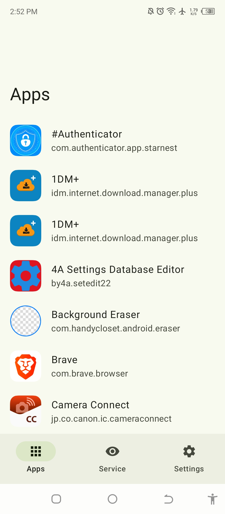
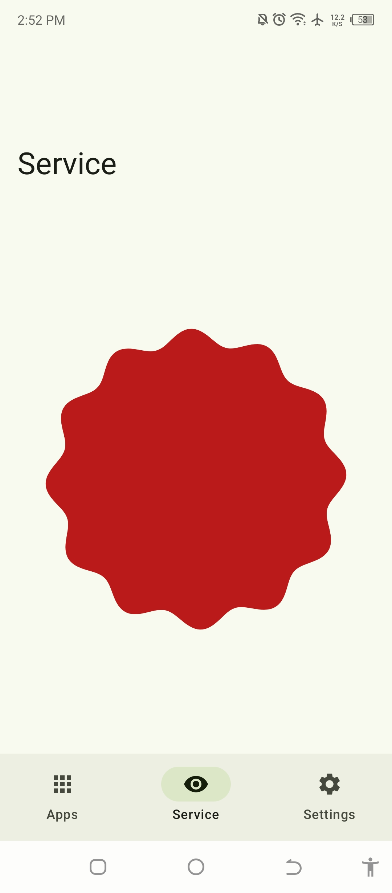
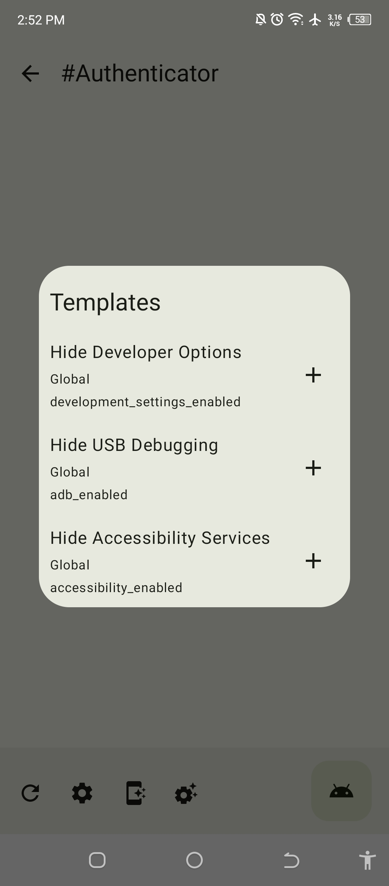
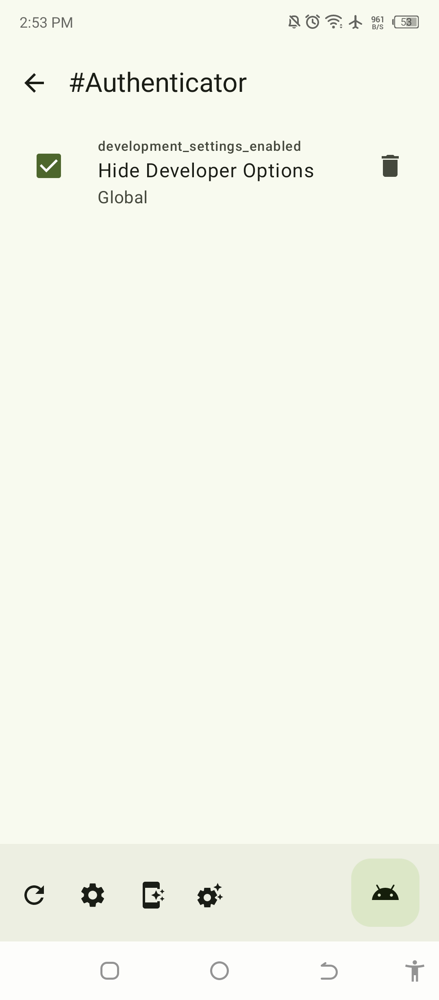
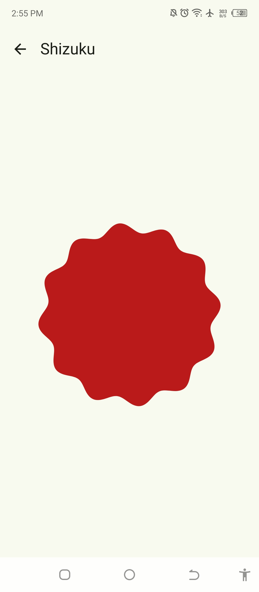

# Geto

Apply custom settings to your apps

About The Project
==================

The only reason I created this app is to turn off that damn Developer Options when using a banking
app. The only annoying thing about it is you have to go to the Settings app. When you turn off that
switch button, your Developer Options configurations will be reset to default. The good thing is
that when you modify your settings through its Shared Preferences, you won't lose all your settings
once the Developer Options is modified. So basically, you have to grant this app
with `android.permission.WRITE_SECURE_SETTINGS` in order for it to modify your Settings values.

> [!IMPORTANT]  
> We moved the instructions on how to use this application into
> our [Wiki](https://github.com/JackEblan/Geto/wiki) and [Youtube](https://youtu.be/CJrJyHpVVRM?si=ACrEC0hcPed53RAj)

# Screenshots

# License

**Geto** is licensed under the GNU General Public License v3.0. See the [license](LICENSE) for more
information.

